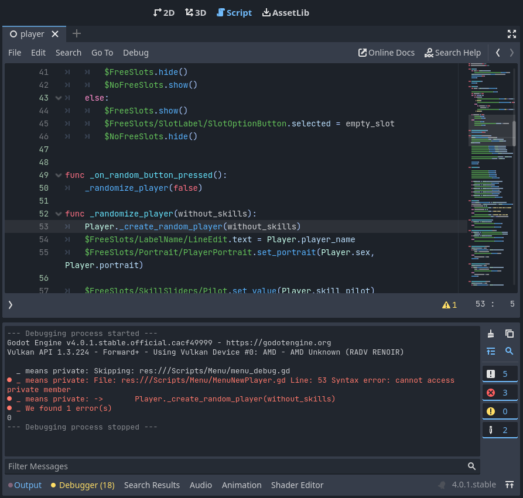

# Underscore Means Private

## Bringing the notion of public / private to Godot

### TLDR
Underscore Means Private is an addon to add the notion of public / private members for Godot 4.0+. This is done by enforcing the Godot convention of using underscore (_) for private variables and methods. Check the [documentation](Documentation.md) for more information.

## Long Explanation

Unlike many other programming languages, GDScript does not have a built-in notion of public and private visibility for variables and methods.

In GDScript, all variables and methods are accessible from any part of the script or other scripts within the same scope.

GDScript encourages a convention-based approach to signify the intended visibility of variables and methods. By convention, variables and methods that start with an underscore (_) are considered to be private. Variables and methods without an underscore are considered public and can be accessed by other scripts.

This convention is not enforced by the language itself, this is where this addon comes into play. It will run before you start your game, checking all the files to inforce the convention.

# Other Rules

Presently, the addon enforces two additional rules.
* vars and consts of a class must specify a type to help with auto completion
* publicly accessible functions of a class must specify a return type

More rules might be added in the future.

# Limitations

* ~~Currently sadly you cannot do a dry run (if you enable the script you must fix all the issues before you can start the game)~~. It is now possible to run without aborting the game.
* You cannot easily click on the error message to access the line where the error was detected.
* This script is trivial to bypass (eg: you could use a trick like "." + "_") to access private member.
* It’s not meant to be a perfect solution, but more like a tool to enforce good conventions.

# Planned features

* Refactor the script ✅
* Open source the script ✅
* Add the option to do a dry run (do no prevent the game to start if errors are detected). ✅
* Expose in the settings the various rules to allow to easily enable / disable them in your project. ✅
* Improve the way we check certain rules
* Check for private functions return type
* Check for function parameters type
* Find a way to make it possible to click on the log message to access the file & line of the error
